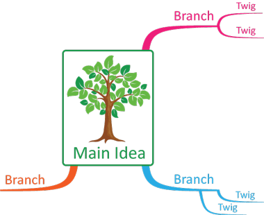
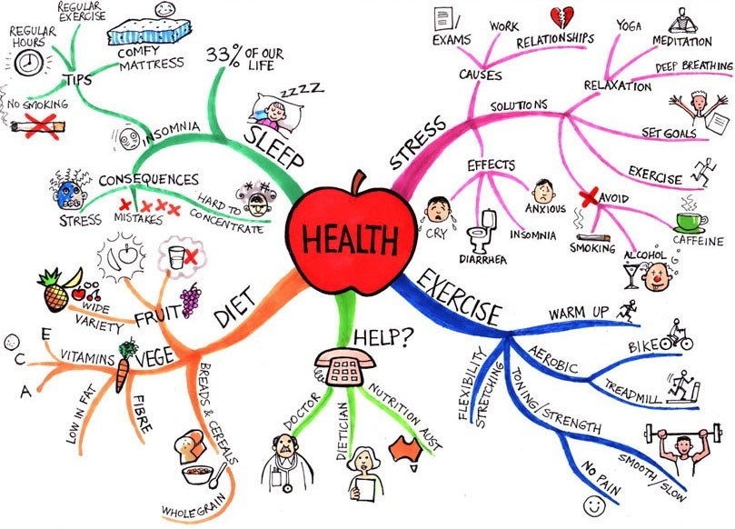
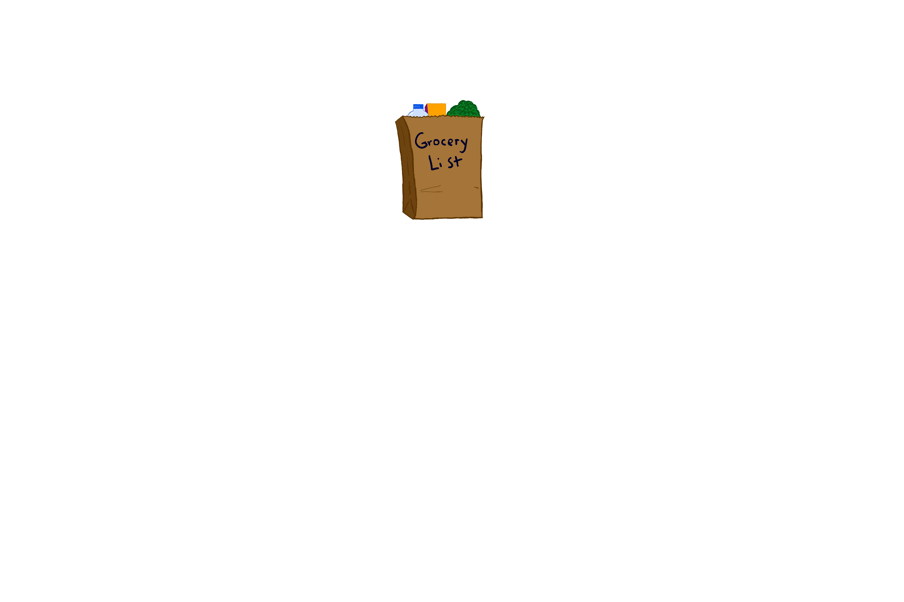
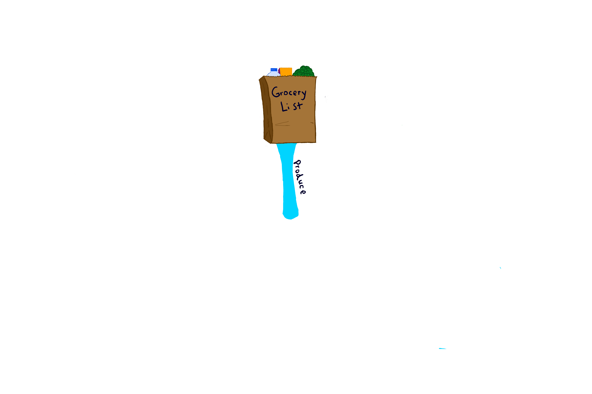
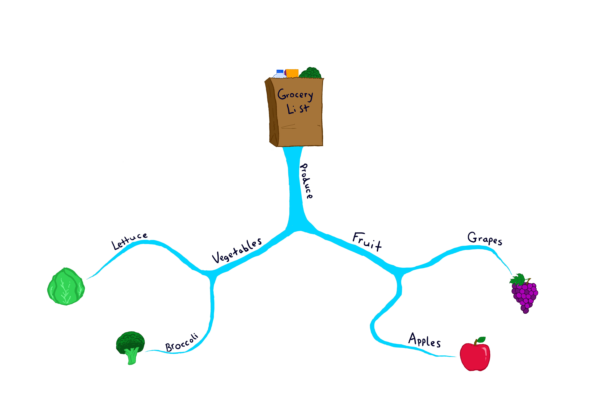
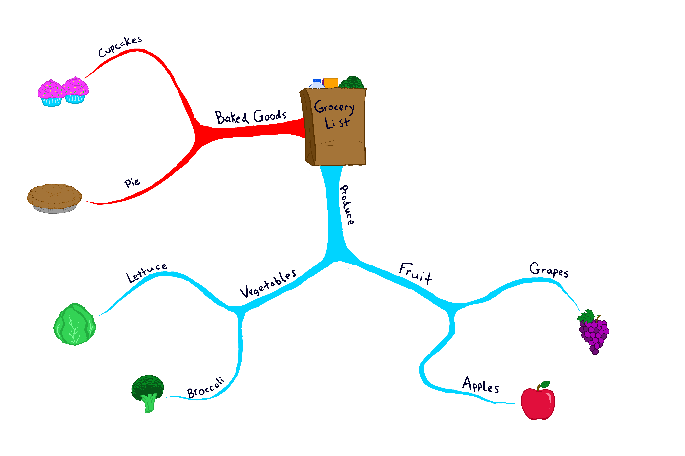
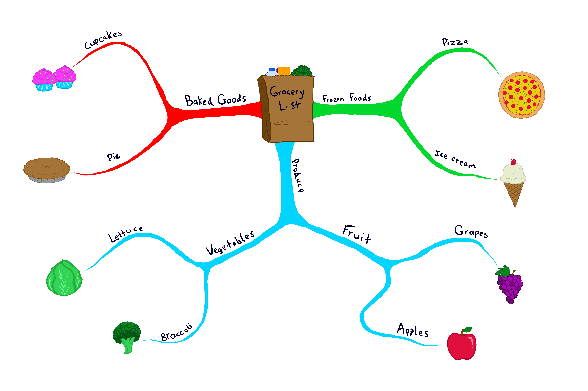

# What is Mind Mapping?

By Riva McKnight May 13, 2021

Mind mapping is the process of making a mind map. So, what are mind maps? What are they used for? How do you make one? Before answering these questions, let me share how I was introduced to the idea.

I first heard about mind mapping years ago when I read the book [Moonwalking with Einstein](https://www.amazon.com/Moonwalking-Einstein-Science-Remembering-Everything/dp/0143120530/ref%3Dsr_1_2?crid%3D1BOZEO18M8PMB%26dchild%3D1%26keywords%3Dmoonwalking%2Bwith%2Beinstein%2Bby%2Bjoshua%2Bfoer%26qid%3D1620873399%26sprefix%3Dmoonwal%252Caps%252C571%26sr%3D8-2&amp;sa=D&amp;source=editors&amp;ust=1621133106009000&amp;usg=AOvVaw0zfe7WwsciZQ_U1NyaZYqa) by Joshua Foer. The book is about Foer's entertaining experiences with competitive memory training. Throughout his adventures, he meets many eccentric characters, one of whom was Tony Buzan. Buzan is known as the modern founder of mind mapping and is the one who introduces the technique to the author. I found the concept of mind mapping interesting at the time and even did some research on it, but never adopted it for my personal use. More recently, I took a writing class and the term came up again as a way to generate ideas when starting to write. Because of this, I decided to explore mind mapping again and share the basic idea with others who may not be familiar with the concept.

## What is a mind map?
Wikipedia answers this well: a mind map is a diagram created to visually organize
information. It has one central concept or **main idea** which is drawn or written at the
center. From the center, **branches** are drawn which represent the major topics of that core
concept. These branches are typically drawn as curved lines, which may have variable
thickness, color, and shape. Each topic can be further classified by drawing thinner, smaller
branches or **twigs** which are subtopics of the previous branch.

|  |
| --- |
| *The basic format of a mind map* |

Branching can continue as much as necessary to complete the thought or concept. When
fully fleshed out, a mind map starts to take on a web-like form, almost like a neuron in the
brain. The mind map on health below illustrates this well.

|  |
| --- |
| *A mind map on health* |

Mind maps are more memorable when they make use of images, colors, and use only
keywords. Mind maps can be hand-drawn with pen and paper, but you can also create
them on a computer. There are even some software programs available that allow a user
to create mind maps.

## What are they used for?
Mind maps have multiple uses. You can use them as a learning tool or to share
information. Some of the main uses are listed below:

- Note-taking
- Memorizing an idea or concept
- Brainstorming
- Communicating an idea visually

## How do you make one?
Using the ideas outlined above, let's make one together. Look at the grocery list below. We
are going to take this list and turn it into a mind map.

**Grocery List** 
&#9744; Apples 
&#9744; Grapes 
&#9744; Broccoli 
&#9744; Lettuce 
&#9744; Cupcakes 
&#9744; Pie 
&#9744; Icecream 
&#9744; Frozen pizza 

Our central concept is the **grocery list**. Let's create an image [^1] for that.

We have some **produce** items, let's add a branch for these.

Let's continue working on the produce branch. Our list contains both **fruits** and
**vegetables.** We can create a twig for each and then add the specific fruits and vegetables
on their respective branch.

We also have some **baked goods**. Let's add that category as another branch and add the
different foods as twigs.

Finally, the remaining items are **frozen foods**. We can add a final branch for this, along with
twigs for the individual items.

That's it, we've created a mind map of our grocery list.

If we wanted to go to the grocery store and pick up the items without using a physical list,
which way would be easier to commit the needed items to your memory? I feel I could
memorize the mind map image, but I would have more trouble memorizing just the words.

Now that you know what a mind map is, how to use one, and how to create one, have fun
exploring and creating your own mind maps.

[^1]: *All images in this section are original works of Shannon McKnight.*